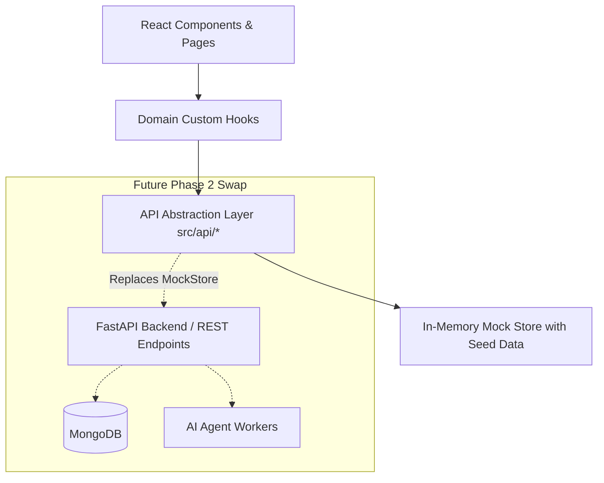

# Germany Job Hunt — Architecture & Data Flow

## 1. Phase 1 Architecture


## 2. Directory Structure
```
job-search/
├── docs/
│   ├── PRD.md
│   ├── AGENTS.md
│   ├── DESIGN_SYSTEM.md
│   └── ARCHITECTURE.md
├── src/
│   ├── api/             # API client abstraction (mocked in Phase 1)
│   ├── components/
│   │   ├── common/      # AppShell, Sidebar, Header, Breadcrumbs
│   │   ├── ui/          # Badges, Buttons, Cards, Drawer, Modal, Tabs
│   │   ├── workspace/   # 3-column Application Workspace components
│   │   └── jobs/        # JobTable, JobFilter, JobPreviewDrawer
│   ├── mocks/           # Rich synthetic data sets & mock store
│   ├── pages/           # Route views
│   ├── types/           # Strict TypeScript contracts (backend-ready)
│   ├── App.tsx          # Router and Provider configuration
│   ├── main.tsx         # Vite React root
│   └── index.css        # Tailwind & Design tokens
├── index.html
├── package.json
├── tsconfig.json
├── vite.config.ts
└── vitest.config.ts
```

## 3. Data Contracts
All contracts are declared in `src/types/index.ts` to ensure 100% type safety and painless transition to FastAPI Pydantic models in Phase 2.
